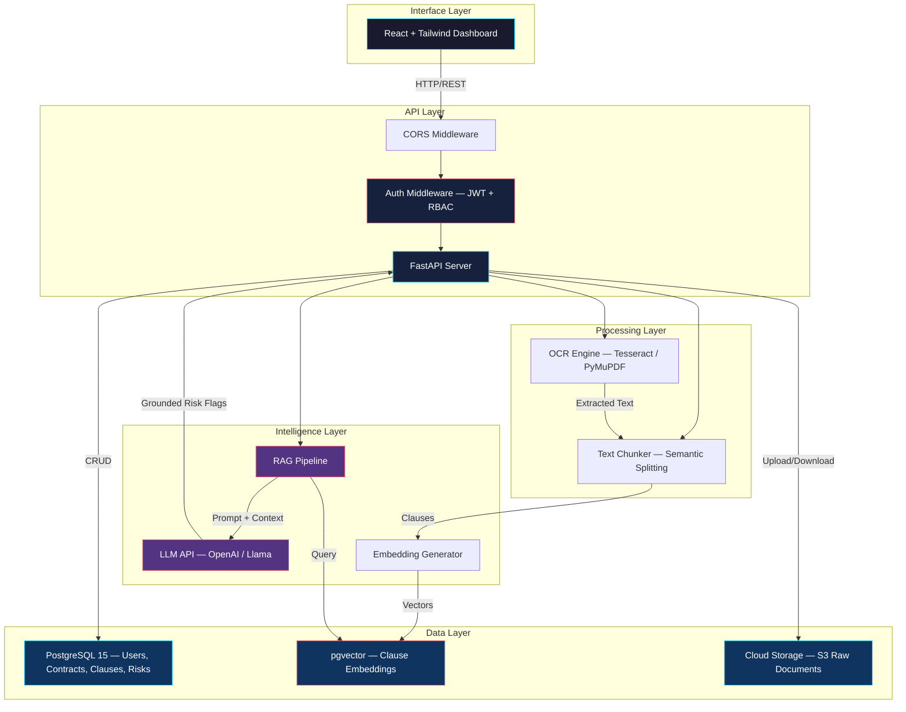
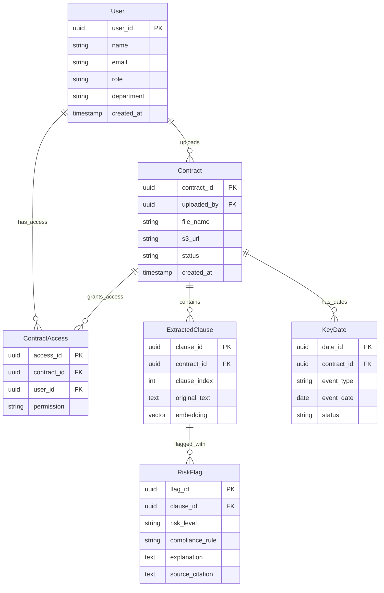

<div align="center">

# 🔍 ClauseIQ

### AI Contract Intelligence & Compliance Assistant

**Deloitte Capstone Project — 2027**

[](https://python.org)
[](https://fastapi.tiangolo.com)
[](https://react.dev)
[](https://postgresql.org)
[](LICENSE)

</div>

---

## 📋 Table of Contents

- [Problem Statement](#-problem-statement)
- [Solution Overview](#-solution-overview)
- [Tech Stack](#-tech-stack)
- [System Workflow](#-system-workflow)
- [Architecture](#-architecture)
- [Database Schema](#-database-schema)
- [Project Structure](#-project-structure)
- [Getting Started](#-getting-started)
- [Team Tracks](#-team-tracks)
- [Contributing](#-contributing)

---

## 🚨 Problem Statement

Enterprise contract management is fundamentally broken:

| Pain Point | Impact |
|---|---|
| **Manual Review** | Legal teams spend **4–6 hours per contract** on manual clause-by-clause review |
| **Missed Obligations** | Auto-renewal traps and non-standard clauses cost companies **~9% of annual revenue** |
| **Zero Visibility** | Teams have **no centralized dashboard** to track obligations, expiry dates, or compliance status |
| **Compliance Risk** | Regulatory non-compliance (GDPR, SOX, HIPAA) exposes organizations to **fines and litigation** |

> **Bottom line:** Organizations are hemorrhaging revenue and accumulating legal risk because their contract review process hasn't evolved past spreadsheets and manual effort.

---

## 💡 Solution Overview

**ClauseIQ** is an AI-powered contract intelligence platform that transforms how organizations review, analyze, and monitor legal agreements.

### Core Capabilities

1. **Intelligent Ingestion** — Upload PDF/Word contracts; OCR extracts text from scanned documents automatically.
2. **AI-Powered Analysis** — An LLM paired with Retrieval-Augmented Generation (RAG) screens every clause against compliance checklists, flags risks, and extracts key dates.
3. **Grounded AI** — Every risk flag **cites the exact source text** from the document. No hallucinations. No black boxes.
4. **Obligation Tracking** — A centralized dashboard tracks expiry dates, renewal windows, and compliance obligations across all contracts.
5. **Enterprise Security** — Role-Based Access Control (RBAC), Row-Level Security (RLS) via JWTs, and encrypted cloud storage protect sensitive legal data.

### Key Differentiators

- 🎯 **Citation-backed AI** — Every flag references the exact clause text
- ⚡ **Minutes, not hours** — Reduce contract review from 4–6 hours to under 15 minutes
- 🔒 **Enterprise-grade security** — RBAC + RLS + encrypted storage
- 📊 **Centralized visibility** — One dashboard for all obligations and deadlines

---

## 🛠 Tech Stack

| Layer | Technology | Purpose |
|---|---|---|
| **Interface** | React 18, Tailwind CSS, Lucide Icons | Dashboard UI, document uploads, obligation tracker |
| **API** | FastAPI (Python) | RESTful endpoints, authentication, middleware |
| **Processing** | Python (Tesseract OCR, PyMuPDF) | PDF/Word text extraction, clause chunking |
| **Intelligence** | OpenAI / Llama, LangChain, pgvector | RAG pipeline, risk screening, compliance analysis |
| **Database** | PostgreSQL 15 + pgvector | Relational data (RBAC, audits) + vector embeddings |
| **Storage** | AWS S3 / Cloud Object Storage | Secure document storage |
| **Infra** | Docker, Docker Compose | Local development environment |

---

## 🔄 System Workflow

ClauseIQ operates in three sequential stages:

### Stage 01 — INGEST
```
User uploads PDF/Word contract
        │
        ▼
┌─────────────────────────┐
│  OCR & Text Extraction  │  ← Tesseract / PyMuPDF
│  (scanned → plain text) │
└────────────┬────────────┘
             │
             ▼
┌─────────────────────────┐
│   Clause Chunking &     │  ← Semantic splitting
│   Text Splitting        │
└────────────┬────────────┘
             │
             ▼
    Clauses stored in DB
    + Embeddings → pgvector
```

### Stage 02 — ANALYZE
```
Extracted clauses
        │
        ▼
┌─────────────────────────┐
│  RAG Retrieval          │  ← Query pgvector for
│  (compliance checklist) │     relevant precedents
└────────────┬────────────┘
             │
             ▼
┌─────────────────────────┐
│  LLM Risk Screening     │  ← OpenAI / Llama
│  + Citation Grounding   │     Every flag cites source
└────────────┬────────────┘
             │
             ▼
    Risk flags + Key dates
    stored in PostgreSQL
```

### Stage 03 — TRACK
```
Dashboard reads from DB
        │
        ▼
┌─────────────────────────┐
│  Obligation Tracker     │  ← Expiry dates, renewals
│  Risk Summary Panel     │     compliance status
│  Contract Explorer      │     drill-down per clause
└─────────────────────────┘
```

---

## 🏗 Architecture



---

## 🗄 Database Schema

### PostgreSQL — Relational Tables



### Vector DB — pgvector

| Field | Type | Description |
|---|---|---|
| `clause_id` | UUID (FK) | Links back to `ExtractedClause` |
| `embedding` | `vector(1536)` | OpenAI `text-embedding-3-small` output |
| `metadata` | JSONB | `{ contract_id, clause_index, section_title }` |

> pgvector is installed as a PostgreSQL extension, keeping all data in a single database instance.

---

## 📁 Project Structure

```
ClauseIQ/
├── README.md                    # ← You are here
├── docs/
│   └── ARCHITECTURE.md          # Detailed architecture doc
├── docker-compose.yml           # PostgreSQL 15 + pgvector
├── .env.example                 # Environment variable template
├── .gitignore
│
├── backend/                     # Python — FastAPI
│   ├── main.py                  # App entry point, CORS, health check
│   ├── database.py              # SQLAlchemy engine & session
│   ├── models.py                # ORM models (6 tables)
│   ├── ai_engine.py             # [Placeholder] RAG + LLM pipeline
│   ├── ingestion.py             # [Placeholder] OCR + text chunking
│   └── requirements.txt         # Python dependencies
│
└── frontend/                    # React — Vite + Tailwind
    ├── index.html
    ├── package.json
    ├── tailwind.config.js
    ├── postcss.config.js
    ├── vite.config.js
    └── src/
        ├── App.jsx              # Root layout (sidebar + main)
        ├── index.css            # Tailwind directives + theme
        └── main.jsx             # React entry point
```

---

## 🚀 Getting Started

### Prerequisites

- **Docker & Docker Compose** — for PostgreSQL
- **Python 3.11+** — for the backend
- **Node.js 18+** — for the frontend

### 1. Clone & Configure

```bash
git clone https://github.com/<your-org>/ClauseIQ.git
cd ClauseIQ
cp .env.example .env
# Edit .env with your credentials
```

### 2. Start the Database

```bash
docker-compose up -d
```

### 3. Start the Backend

```bash
cd backend
python -m venv .venv
source .venv/bin/activate   # Windows: .venv\Scripts\activate
pip install -r requirements.txt
uvicorn main:app --reload --port 8000
```

### 4. Start the Frontend

```bash
cd frontend
npm install
npm run dev
# → http://localhost:5173
```

### 5. Verify

- **API Health:** `GET http://localhost:8000/api/health`
- **Dashboard:** `http://localhost:5173`

---

## 👥 Team Tracks

| Track | Owner | Scope | Key Files |
|---|---|---|---|
| **Track 1** — Infra & Database | Lead Engineer | Docker, DB schema, auth | `docker-compose.yml`, `database.py`, `models.py` |
| **Track 2** — AI & Backend | AI/Backend Team | FastAPI, RAG, OCR | `main.py`, `ai_engine.py`, `ingestion.py` |
| **Track 3** — UI | Frontend Team | React dashboard, Tailwind | `frontend/src/*` |

---

## 🤝 Contributing

1. Create a feature branch: `git checkout -b feature/<track>-<description>`
2. Follow the naming convention: `track1/`, `track2/`, `track3/` prefixes
3. Write descriptive commit messages
4. Open a PR against `main` with your track lead as reviewer

---

<div align="center">

**Built with ❤️ for the Deloitte Capstone 2027**

</div>
