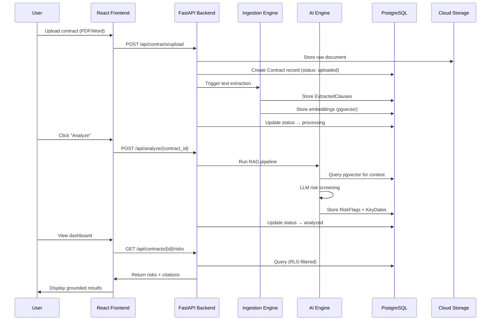

# ClauseIQ — Architecture Document

## Overview

ClauseIQ is a four-layer architecture designed for secure, AI-powered contract analysis. Each layer is independently deployable and communicates via well-defined interfaces.

---

## Layer Architecture

### 1. Interface Layer (Frontend)

| Component | Technology | Responsibility |
|---|---|---|
| Dashboard | React 18 + Tailwind CSS | Obligation tracker, risk summaries, contract explorer |
| Upload Module | React Dropzone + Axios | Drag-and-drop PDF/Word upload with progress tracking |
| Auth UI | React Context + JWT | Login, role-based UI gating |
| Icons | Lucide React | Consistent iconography |

**Key Design Decisions:**
- Vite for fast HMR during development
- Tailwind for utility-first styling consistency across the team
- Axios interceptors handle JWT refresh and 401 redirects

---

### 2. API Layer (Backend)

| Component | Technology | Responsibility |
|---|---|---|
| REST API | FastAPI | All CRUD endpoints, file upload endpoints |
| Auth Middleware | python-jose + JWT | Token verification, role extraction |
| CORS | FastAPI CORSMiddleware | Allow frontend dev server connections |
| Validation | Pydantic v2 | Request/response schema validation |

**Endpoints (Planned):**

```
GET    /api/health              → Health check
POST   /api/auth/login          → JWT issuance
GET    /api/contracts            → List contracts (RLS-filtered)
POST   /api/contracts/upload     → Upload + trigger ingestion
GET    /api/contracts/{id}       → Contract detail + clauses
GET    /api/contracts/{id}/risks → Risk flags for contract
GET    /api/obligations          → Upcoming key dates
POST   /api/analyze/{id}        → Trigger AI analysis
```

---

### 3. Processing & Intelligence Layer

#### OCR & Ingestion Pipeline (`ingestion.py`)

```
PDF/Word Upload
     │
     ├─ Native PDF → PyMuPDF text extraction
     │
     └─ Scanned PDF → Tesseract OCR → plain text
            │
            ▼
    Clause Splitter (semantic chunking)
            │
            ▼
    Store clauses in ExtractedClause table
    Generate embeddings → pgvector
```

#### RAG & Analysis Pipeline (`ai_engine.py`)

```
Compliance Checklist (prompt template)
     │
     ▼
Query pgvector for similar clauses
     │
     ▼
Construct RAG context window
     │
     ▼
LLM Analysis (OpenAI / Llama)
     │
     ▼
Parse structured output:
  - RiskFlag (with source_citation)
  - KeyDate extraction
     │
     ▼
Store results in PostgreSQL
```

**Grounding Requirement:** The LLM prompt enforces that every risk flag must include a `source_citation` field containing the exact text from the contract that triggered the flag. Responses without citations are rejected.

---

### 4. Data Layer

#### PostgreSQL 15 + pgvector

Single database instance hosting both relational tables and vector embeddings.

**Security Model:**

```
┌─────────────────────────────────────┐
│           JWT Token                  │
│  { user_id, role, department }       │
└──────────────┬──────────────────────┘
               │
               ▼
┌─────────────────────────────────────┐
│         RBAC Middleware              │
│  role ∈ { admin, reviewer, viewer }  │
│  admin    → full access              │
│  reviewer → read/write own dept      │
│  viewer   → read-only assigned       │
└──────────────┬──────────────────────┘
               │
               ▼
┌─────────────────────────────────────┐
│     Row-Level Security (RLS)         │
│  ContractAccess table filters        │
│  query results per user_id           │
└─────────────────────────────────────┘
```

#### Cloud Object Storage (S3)

- Raw uploaded documents stored with `contract_id` as the key
- Pre-signed URLs for secure time-limited download
- Bucket-level encryption (AES-256)

---

## Data Flow — End to End



---

## Deployment Topology (Future)

```
┌──────────────────┐     ┌──────────────────┐
│   Vercel / CDN   │     │   AWS / GCP      │
│   (Frontend)     │────▶│   (Backend API)  │
└──────────────────┘     └────────┬─────────┘
                                  │
                    ┌─────────────┼─────────────┐
                    │             │             │
              ┌─────▼────┐ ┌─────▼────┐ ┌─────▼────┐
              │ PostgreSQL│ │   S3     │ │ OpenAI   │
              │ + pgvector│ │  Bucket  │ │   API    │
              └──────────┘ └──────────┘ └──────────┘
```

---

## Security Considerations

1. **Data at Rest:** S3 bucket encryption (AES-256), PostgreSQL TDE
2. **Data in Transit:** HTTPS/TLS for all API communication
3. **Authentication:** JWT tokens with short expiry + refresh tokens
4. **Authorization:** RBAC (admin/reviewer/viewer) + RLS via ContractAccess table
5. **Input Validation:** Pydantic schemas reject malformed requests
6. **File Validation:** MIME type checking on uploads (PDF/DOCX only)
7. **Audit Trail:** All contract access and analysis events are logged
