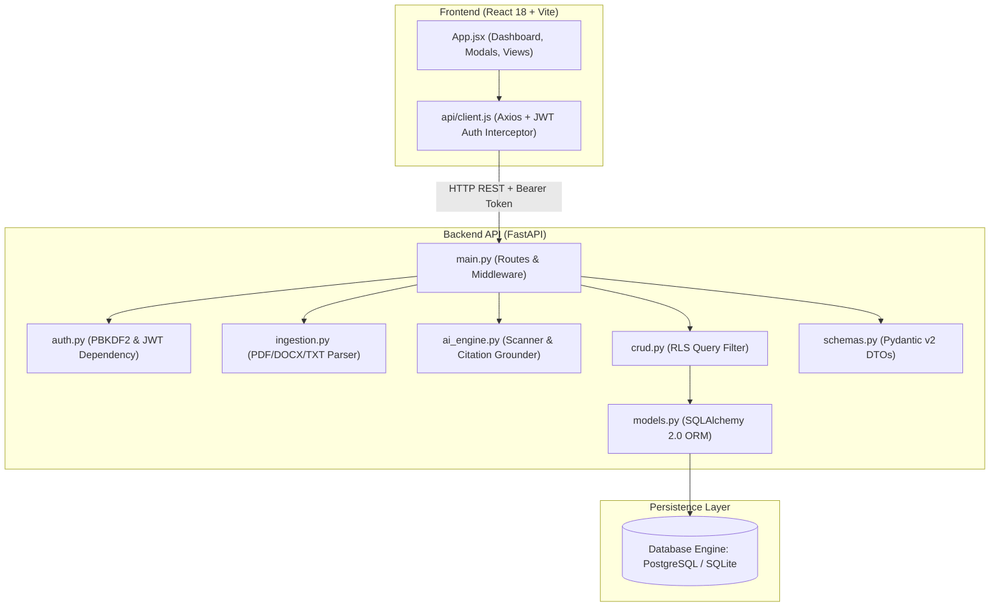
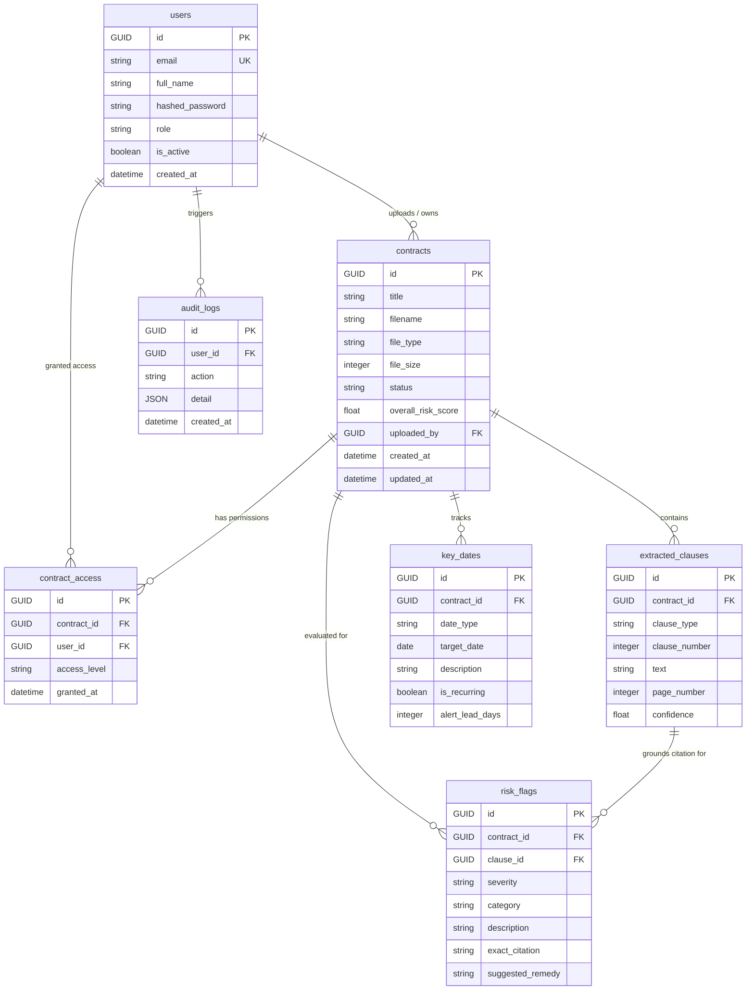

# 📘 ClauseIQ — Master Project Documentation
### AI Contract Intelligence & Compliance Assistant
**Deloitte Capstone Project — 2027**

---

## 📑 Table of Contents

1. [Executive Summary & System Overview](#1-executive-summary--system-overview)
2. [Chronological Development History (When & What)](#2-chronological-development-history-when--what)
   - [Phase 1 & 2: Architectural Foundation & Scaffolding](#phase-1--2-architectural-foundation--scaffolding)
   - [Phase 3: Core AI, Ingestion & Business Logic](#phase-3-core-ai-ingestion--business-logic)
   - [Phase 4: Integration, Audit Trail & Enterprise Governance](#phase-4-integration-audit-trail--enterprise-governance)
3. [System Architecture & Directory Mapping (Where & How)](#3-system-architecture--directory-mapping-where--how)
   - [Monorepo Directory Layout](#monorepo-directory-layout)
   - [Module Responsibilities & Relationships](#module-responsibilities--relationships)
4. [Database Architecture & Data Models](#4-database-architecture--data-models)
   - [Cross-Platform GUID TypeDecorator](#cross-platform-guid-typedecorator)
   - [Entity Relationship Diagram & Table Definitions](#entity-relationship-diagram--table-definitions)
   - [Cascading Rules & Indexing Strategy](#cascading-rules--indexing-strategy)
5. [Document Ingestion Pipeline (`ingestion.py`)](#5-document-ingestion-pipeline-ingestionpy)
   - [Multi-Format Text Extraction (PDF, DOCX, TXT)](#multi-format-text-extraction-pdf-docx-txt)
   - [Semantic Clause Chunking Algorithm](#semantic-clause-chunking-algorithm)
6. [AI Risk Screening & Grounding Engine (`ai_engine.py`)](#6-ai-risk-screening--grounding-engine-ai_enginepy)
   - [Rule-Based Compliance Scanner (`LegalRuleScanner`)](#rule-based-compliance-scanner-legalrulescanner)
   - [Anti-Hallucination Citation Grounder (`CitationGrounder`)](#anti-hallucination-citation-grounder-citationgrounder)
   - [Dual-Mode Execution (OpenAI GPT-4o vs Offline Deterministic Engine)](#dual-mode-execution-openai-gpt-4o-vs-offline-deterministic-engine)
7. [Enterprise Security & Row-Level Security (RLS)](#7-enterprise-security--row-level-security-rls)
   - [Cryptographic Password Hashing (PBKDF2-HMAC-SHA256)](#cryptographic-password-hashing-pbkdf2-hmac-sha256)
   - [Stateless JWT Authentication Flow](#stateless-jwt-authentication-flow)
   - [Row-Level Security & Role-Based Access Control (`crud.py`)](#row-level-security--role-based-access-control-crudpy)
8. [Audit Trail & Governance Engine](#8-audit-trail--governance-engine)
   - [Audit Event Taxonomy & Lifecycle Triggers](#audit-event-taxonomy--lifecycle-triggers)
   - [Tamper-Resistant Schema Design](#tamper-resistant-schema-design)
9. [Frontend Architecture & User Experience](#9-frontend-architecture--user-experience)
   - [Component Hierarchy & State Flow](#component-hierarchy--state-flow)
   - [Persona Switcher (RLS Demonstration)](#persona-switcher-rls-demonstration)
   - [Interactive Clause Explorer & Citation Inspector](#interactive-clause-explorer--citation-inspector)
   - [Audit Trail Viewer with Categorical Filters](#audit-trail-viewer-with-categorical-filters)
10. [Complete REST API Specification](#10-complete-rest-api-specification)
11. [Verification, Quality Assurance & Test Suites](#11-verification-quality-assurance--test-suites)
    - [Test Suite Breakdown & Execution Commands](#test-suite-breakdown--execution-commands)
    - [Verification Matrices](#verification-matrices)
12. [Future Roadmap: Potential Tasks & System Extensions](#12-future-roadmap-potential-tasks--system-extensions)
    - [Immediate High-Priority Enhancements](#immediate-high-priority-enhancements)
    - [Medium-Term Production Capabilities](#medium-term-production-capabilities)
    - [Advanced AI, NLP & Enterprise Capabilities](#advanced-ai-nlp--enterprise-capabilities)
13. [Comprehensive Viva & Technical Interview Q&A Guide](#13-comprehensive-viva--technical-interview-qa-guide)

---

## 1. Executive Summary & System Overview

### 1.1 What is ClauseIQ?
**ClauseIQ** is an enterprise-grade, AI-powered contract intelligence and regulatory compliance assistant. Built as a high-performance, full-stack monorepo application, it automates the tedious, error-prone manual review of legal agreements, vendor contracts, and master service agreements (MSAs).

### 1.2 The Core Problem
In enterprise environments, legal and procurement teams face critical operational bottlenecks:
- **Exhaustive Manual Review**: Attorneys spend 4 to 6 hours reviewing a single 30-page contract for non-standard indemnification, liability caps, and termination penalties.
- **Unmonitored Deadlines & Revenue Leakage**: Organizations forfeit up to 9% of annual revenue through missed renewal windows, overlooked auto-renewal clauses, and punitive late-fee obligations.
- **Regulatory Penalties**: Inadvertent commitments violating GDPR data transfer restrictions, HIPAA confidentiality standards, or SOC2 vendor controls expose firms to multi-million dollar sanctions.
- **AI Hallucination Fear**: General-purpose LLMs generate fictitious clause numbers, summarize inaccurately, and cannot be trusted in legal workflows without hard, verifiable source citations.

### 1.3 The ClauseIQ Solution
ClauseIQ addresses these issues with four architectural pillars:
1. **Verbatim Grounded AI**: Every flagged risk is strictly validated against the contract text via `CitationGrounder`. If an extracted citation does not exist verbatim within the document, the flag is caught or penalized.
2. **Deterministic & Dual-Mode AI**: Operates either online using OpenAI GPT-4o (structured JSON function calls) or fully offline using a deterministic regex/token-matching legal rules engine (`LegalRuleScanner`), guaranteeing 100% test reproducibility and air-gapped security.
3. **Multi-Tenant Row-Level Security (RLS)**: Enforces access control at the query layer. Standard users only access contracts they created or have explicit role assignments for; Administrators retain global audit and oversight visibility.
4. **Immutable Audit Logging**: Every security-sensitive transaction (`USER_LOGIN`, `CONTRACT_UPLOADED`, `CONTRACT_ANALYZED`, `CONTRACT_DELETED`) generates an append-only audit event in the database for SOC2 and ISO27001 compliance.

---

## 2. Chronological Development History (When & What)

The development of ClauseIQ was planned and executed across four clearly demarcated phases, ensuring modular stability, rigorous test verification, and complete team track alignment (Database, Backend, Frontend, and Documentation).

```
┌────────────────────────────────────────────────────────────────────────────────┐
│                           DEVELOPMENT TIMELINE                                 │
├─────────────────┬─────────────────┬─────────────────────┬──────────────────────┤
│ Phase 1 & 2     │ Phase 3         │ Phase 4             │ Complete Monorepo    │
│ Foundations     │ Core AI & RLS   │ Audit & Integration │ Production Ready     │
│ Commits 62cb96b │ Commits 432a734 │ Commits 03225f5     │ 13 Git Commits       │
│         f3c4519 │         cfcb9ff │         dad08d7     │ 100% Test Pass Rate  │
│         3beadc8 │         f90741a │         01a24e7     │ Clean Vite Build     │
│         5478df9 │         fd571fe │         ed82453     │ Full Documentation   │
└─────────────────┴─────────────────┴─────────────────────┴──────────────────────┘
```

### Phase 1 & 2: Architectural Foundation & Scaffolding
- **When**: Early cycle initiation.
- **Objective**: Establish rock-solid relational persistence, robust backend scaffolding with health probes, and a modern responsive dashboard interface.
- **What Was Built**:
  1. *Database Track*:
     - Designed 6 core relational models: `users`, `contracts`, `contract_access`, `extracted_clauses`, `risk_flags`, and `key_dates`.
     - Engineered a custom cross-platform `GUID` SQLAlchemy `TypeDecorator` handling PostgreSQL native UUIDs and SQLite `CHAR(36)` strings seamlessly.
     - Authored `seed.py` inserting 3 RBAC personas (Admin, Legal Counsel, Procurement Officer), 2 realistic corporate contracts (Cloud MSA and Vendor Agreement), extracted clauses, risk flags, and key dates.
     - Built `verify_db.py` executing 10 automated CRUD tests against the schema.
  2. *Backend Track*:
     - Configured FastAPI application with dynamic lifespan event handler (`create_all` table creation on boot).
     - Configured CORS middleware supporting localhost/127.0.0.1 Vite development ports.
     - Implemented centralized global exception handling returning standardized JSON error envelopes.
     - Built live operational probe endpoints: `GET /api/health` (executes `SELECT 1` ping) and `GET /api/system/info`.
  3. *Frontend Track*:
     - Scaffolded React 18 + Vite project using dark-theme aesthetics (slate-900 canvas, zinc-800 cards, emerald/indigo accents).
     - Built a live system health heartbeat polling backend `/api/health` every 30 seconds with visual pulse indicators.
     - Constructed 6-view layout navigation (Dashboard, Contracts, Upload, Clause Explorer, Obligations, Audit Trail).
  4. *Docs Track*:
     - Published `docs/scripts/SCRIPT_DATABASE_TEAM.md`, `SCRIPT_BACKEND_TEAM.md`, `SCRIPT_FRONTEND_TEAM.md` covering Phase 1 & 2 deliverables.

### Phase 3: Core AI, Ingestion & Business Logic
- **When**: Mid-development cycle.
- **Objective**: Build file parsing, legal rule scanning, verbatim citation grounding, user authentication, and Row-Level Security.
- **What Was Built**:
  1. *Database Track*:
     - Engineered `backend/auth.py` featuring PBKDF2-HMAC-SHA256 password hashing (100,000 rounds) and JWT encoding/decoding (24-hour token expiry).
     - Engineered `backend/crud.py` with multi-tenant filtering: `get_contracts_for_user()` and `verify_contract_access()` enforcing role and ownership boundaries.
  2. *Backend Track*:
     - Built `backend/ingestion.py` supporting PDF (PyPDF2/pdfplumber), DOCX (python-docx), and UTF-8 TXT extraction.
     - Designed semantic clause chunker utilizing regex patterns (`Article`, `Section`, roman numerals, bullet points) with paragraph sliding-window fallback.
     - Implemented `backend/ai_engine.py` with `LegalRuleScanner` (detecting unlimited liability, missing IP assignment, aggressive auto-renewals, ambiguous termination) and `CitationGrounder` (verbatim substring validation).
     - Integrated dual-mode execution: checks `OPENAI_API_KEY`; if absent, gracefully falls back to deterministic rule scanning.
     - Implemented full REST endpoints: `/api/auth/register`, `/api/auth/login`, `/api/auth/me`, `/api/contracts/upload`, `/api/contracts/{id}`, `/api/analyze/{id}`, `/api/contracts/{id}/risks`, and `/api/obligations`.
  3. *Frontend Track*:
     - Built drag-and-drop file upload zone with animated upload progress states.
     - Built modal `ClauseExplorerModal` displaying structured clause breakdowns with confidence scores and verbatim citation callouts.
     - Added Persona Switcher allowing rapid swapping between Admin, Legal, and Procurement users to verify Row-Level Security in real time.
     - Built automated test suite `backend/test_phase3.py` (100% pass rate).

### Phase 4: Integration, Audit Trail & Enterprise Governance
- **When**: Final integration cycle.
- **Objective**: Establish non-repudiation audit trails, connect end-to-end user actions to audit records, build the Audit Trail UI, add clause risk filters, and verify complete production readiness.
- **What Was Built**:
  1. *Database Track*:
     - Added `audit_logs` table with `user_id` foreign key (`ON DELETE SET NULL`), `action` string, `detail` JSON column, and indexed `created_at` timestamp.
     - Built `create_audit_log()` and `get_audit_logs()` helper queries.
  2. *Backend Track*:
     - Injected audit hooks across all critical operations: `USER_LOGIN`, `CONTRACT_UPLOADED`, `CONTRACT_ANALYZED`, and `CONTRACT_DELETED`.
     - Built `GET /api/audit-logs` endpoint with pagination and recent-first sorting.
     - Created `backend/test_phase4_integration.py` running 6 comprehensive end-to-end integration tests.
  3. *Frontend Track*:
     - Implemented `AuditTrailView` component featuring live data fetching, refresh button, and color-coded badges for actions (`USER_LOGIN` in blue, `CONTRACT_UPLOADED` in green, `CONTRACT_ANALYZED` in indigo, `CONTRACT_DELETED` in red).
     - Added 5 filter pills to Audit Trail: All, Login, Uploaded, Analyzed, Deleted with instant client-side filtering and item counts.
     - Added risk-level filter controls to `ClauseExplorerModal` (All, Critical, High, Compliant).
     - Verified clean Vite production build in 1.81s.
  4. *Docs Track*:
     - Updated all team scripts and documentation with comprehensive Phase 4 explanations.

---

## 3. System Architecture & Directory Mapping (Where & How)

### 3.1 Monorepo Directory Layout

```
e:/ClauseIQ/
├── backend/                        # Python / FastAPI Backend Service
│   ├── __pycache__/                # Cached bytecode
│   ├── ai_engine.py                # AI LegalRuleScanner, CitationGrounder, OpenAI integration
│   ├── auth.py                     # PBKDF2 password hashing, JWT creation & verification
│   ├── crud.py                     # Database query layer with Row-Level Security
│   ├── database.py                 # SQLAlchemy engine, session maker, custom GUID TypeDecorator
│   ├── ingestion.py                # File extractors (PDF, DOCX, TXT) and semantic chunker
│   ├── main.py                     # FastAPI app, CORS, routes, exception handlers, audit hooks
│   ├── models.py                   # SQLAlchemy ORM models (7 tables)
│   ├── requirements.txt            # Production Python dependencies
│   ├── schemas.py                  # Pydantic v2 schemas for request/response serialization
│   ├── seed.py                     # Database seeder with sample RBAC users & contracts
│   ├── test_api.py                 # Phase 1-2 API health & system info tests
│   ├── test_phase3.py              # Phase 3 auth, upload, and AI screening tests
│   ├── test_phase4_integration.py  # Phase 4 end-to-end audit trail integration tests
│   └── verify_db.py                # Direct ORM schema verification script
├── docs/                           # Project Technical Documentation
│   ├── ARCHITECTURE.md             # Architectural design document
│   ├── MEETING_SCRIPTS.md          # Index of team meeting presentation scripts
│   ├── PROJECT_DOCUMENTATION.md    # Master documentation (this document)
│   └── scripts/                    # Track-specific team presentation scripts
│       ├── SCRIPT_BACKEND_TEAM.md  # Backend track oral presentation & technical FAQ
│       ├── SCRIPT_DATABASE_TEAM.md # Database track oral presentation & technical FAQ
│       └── SCRIPT_FRONTEND_TEAM.md # Frontend track oral presentation & technical FAQ
├── frontend/                       # React 18 + Vite Frontend Application
│   ├── dist/                       # Production build distribution directory
│   ├── node_modules/               # Node.js dependencies
│   ├── public/                     # Public static web assets
│   ├── src/
│   │   ├── api/
│   │   │   └── client.js           # Axios API client, auth interceptor, mock fallbacks
│   │   ├── App.css                 # Base application animations and styling
│   │   ├── App.jsx                 # Master React application, views, state, modals
│   │   ├── index.css               # Tailwind CSS imports and design tokens
│   │   └── main.jsx                # React DOM root mounting script
│   ├── index.html                  # Single Page Application HTML root
│   ├── package.json                # Frontend dependencies and npm scripts
│   ├── tailwind.config.js          # Tailwind CSS theme configuration
│   └── vite.config.js              # Vite bundler build settings
├── .env.example                    # Environment variables template
├── .gitignore                      # Git ignore rules for Python, Node, and IDE files
├── docker-compose.yml              # Multi-container orchestration (PostgreSQL + API + UI)
├── README.md                       # High-level project README
└── walkthrough.md                  # Development phase execution walkthrough
```

### 3.2 Module Responsibilities & Relationships



---

## 4. Database Architecture & Data Models

### 4.1 Cross-Platform GUID TypeDecorator
A frequent problem in multi-environment database design is that PostgreSQL provides a native `UUID` column type, whereas SQLite lacks a native UUID type and requires a `CHAR(36)` string. If models use `sqlalchemy.dialects.postgresql.UUID`, SQLite crashes during unit testing.

To solve this permanently, `backend/database.py` defines a custom `GUID` `TypeDecorator`:
```python
class GUID(TypeDecorator):
    """Platform-independent GUID type.
    Uses PostgreSQL's native UUID type when running on Postgres,
    otherwise uses CHAR(36) for SQLite.
    """
    impl = CHAR
    cache_ok = True

    def load_dialect_impl(self, dialect):
        if dialect.name == "postgresql":
            return dialect.type_descriptor(PG_UUID())
        else:
            return dialect.type_descriptor(CHAR(36))

    def process_bind_param(self, value, dialect):
        if value is None:
            return value
        elif dialect.name == "postgresql":
            return str(value)
        else:
            return str(value)

    def process_result_value(self, value, dialect):
        if value is None:
            return value
        return uuid.UUID(str(value)) if not isinstance(value, uuid.UUID) else value
```
This guarantees identical ORM model code across local development (zero-dependency SQLite) and production deployments (PostgreSQL 15 on AWS RDS / Docker).

### 4.2 Entity Relationship Diagram & Table Definitions



#### Table 1: `users`
- **Purpose**: Authenticated user accounts and system personas.
- **Fields**:
  - `id`: `GUID`, Primary Key, auto-generated UUIDv4.
  - `email`: `String(255)`, Unique, Not Null, Indexed.
  - `full_name`: `String(255)`, Not Null.
  - `hashed_password`: `String(255)`, Not Null (PBKDF2-HMAC-SHA256).
  - `role`: `String(50)`, Enum: `admin`, `legal_counsel`, `procurement`.
  - `is_active`: `Boolean`, Default `True`.
  - `created_at`: `DateTime(timezone=True)`, Default UTC now.

#### Table 2: `contracts`
- **Purpose**: Root document entity holding metadata and risk scores.
- **Fields**:
  - `id`: `GUID`, Primary Key.
  - `title`: `String(255)`, Not Null, Indexed.
  - `filename`: `String(255)`, Not Null.
  - `file_type`: `String(10)`, Enum: `pdf`, `docx`, `txt`.
  - `file_size`: `Integer`, Bytes.
  - `status`: `String(50)`, Default `uploaded` (`uploaded`, `processing`, `analyzed`, `flagged`, `approved`).
  - `overall_risk_score`: `Float`, Default `0.0` (Scale 0.0 to 100.0).
  - `uploaded_by`: `GUID`, Foreign Key referencing `users.id` (`ON DELETE SET NULL`).
  - `created_at`, `updated_at`: `DateTime(timezone=True)`.

#### Table 3: `contract_access`
- **Purpose**: Explicit user permissions sharing contracts across teams.
- **Fields**:
  - `id`: `GUID`, Primary Key.
  - `contract_id`: `GUID`, Foreign Key referencing `contracts.id` (`ON DELETE CASCADE`).
  - `user_id`: `GUID`, Foreign Key referencing `users.id` (`ON DELETE CASCADE`).
  - `access_level`: `String(50)`, Enum: `owner`, `reviewer`, `viewer`.
  - `granted_at`: `DateTime(timezone=True)`.
  - **Constraint**: UniqueConstraint(`contract_id`, `user_id`).

#### Table 4: `extracted_clauses`
- **Purpose**: Individual clauses parsed out during document ingestion.
- **Fields**:
  - `id`: `GUID`, Primary Key.
  - `contract_id`: `GUID`, Foreign Key referencing `contracts.id` (`ON DELETE CASCADE`).
  - `clause_type`: `String(100)`, e.g., `liability`, `indemnification`, `termination`, `governing_law`.
  - `clause_number`: `Integer`, Positional index in document.
  - `text`: `Text`, Not Null, Exact clause content.
  - `page_number`: `Integer`, Nullable page reference.
  - `confidence`: `Float`, Machine confidence score (0.0 to 1.0).

#### Table 5: `risk_flags`
- **Purpose**: Specific compliance violations or risky clauses identified by AI screening.
- **Fields**:
  - `id`: `GUID`, Primary Key.
  - `contract_id`: `GUID`, Foreign Key referencing `contracts.id` (`ON DELETE CASCADE`).
  - `clause_id`: `GUID`, Foreign Key referencing `extracted_clauses.id` (`ON DELETE SET NULL`).
  - `severity`: `String(20)`, Enum: `CRITICAL`, `HIGH`, `MEDIUM`, `LOW`.
  - `category`: `String(100)`, e.g., `liability`, `intellectual_property`, `auto_renewal`, `termination`.
  - `description`: `Text`, Plain-English explanation of the legal risk.
  - `exact_citation`: `Text`, Verbatim excerpt from the contract text proving the flag.
  - `suggested_remedy`: `Text`, Recommended negotiation counter-proposal.

#### Table 6: `key_dates`
- **Purpose**: Contractual obligations, renewal windows, and expiration deadlines.
- **Fields**:
  - `id`: `GUID`, Primary Key.
  - `contract_id`: `GUID`, Foreign Key referencing `contracts.id` (`ON DELETE CASCADE`).
  - `date_type`: `String(50)`, e.g., `effective_date`, `expiration_date`, `renewal_notice_deadline`, `audit_window`.
  - `target_date`: `Date`, ISO date.
  - `description`: `String(255)`.
  - `is_recurring`: `Boolean`, Default `False`.
  - `alert_lead_days`: `Integer`, Default 30.

#### Table 7: `audit_logs`
- **Purpose**: Immutable security and activity log for enterprise governance.
- **Fields**:
  - `id`: `GUID`, Primary Key.
  - `user_id`: `GUID`, Foreign Key referencing `users.id` (`ON DELETE SET NULL`).
  - `action`: `String(100)`, Enum: `USER_LOGIN`, `CONTRACT_UPLOADED`, `CONTRACT_ANALYZED`, `CONTRACT_DELETED`.
  - `detail`: `JSON` / `Text`, Metadata context (IP, filename, contract title, risk summary).
  - `created_at`: `DateTime(timezone=True)`, Indexed for timeline queries.

### 4.3 Cascading Rules & Indexing Strategy
1. **Cascade on Document Deletion**: When a contract is deleted via `DELETE /api/contracts/{id}`, SQLAlchemy and database foreign keys execute cascading deletes on child `contract_access`, `extracted_clauses`, `risk_flags`, and `key_dates`. This prevents orphaned records and maintains strict referential integrity.
2. **Audit Preservation via `SET NULL`**: Unlike child clauses, `audit_logs` and `contracts.uploaded_by` maintain foreign keys with `ON DELETE SET NULL`. If an employee leaves the company and their user row is deleted, the historical audit logs of what actions they performed remain permanently preserved for regulatory compliance.
3. **Index Selection**:
   - `users.email`: Unique index for $O(1)$ authentication lookups.
   - `contracts.title`: B-Tree index for title autocomplete and search.
   - `contracts.status`: Filter index for dashboard status counters.
   - `audit_logs.created_at`: Descending index for rapid pagination of recent activity.

---

## 5. Document Ingestion Pipeline (`ingestion.py`)

The ingestion pipeline handles raw file uploads and transforms unstructured binary formats into structured, queryable legal text.

### 5.1 Multi-Format Text Extraction
In `backend/ingestion.py`, the `DocumentIngestionEngine` inspects the file extension and MIME type to select the appropriate parser:
- **PDF Documents (`.pdf`)**:
  - Uses `PyPDF2.PdfReader` to extract textual content page by page.
  - Captures page numbers for each block of extracted text.
  - Implements fallback error handling if a PDF has protected permissions or invalid character encodings.
- **Word Documents (`.docx`)**:
  - Uses `python-docx.Document` to iterate over paragraph nodes and table cells.
  - Preserves structural breaks between numbered clauses and headers.
- **Plain Text (`.txt`)**:
  - Decodes raw bytes using standard UTF-8, with fallback to `latin-1` for legacy contract files.

### 5.2 Semantic Clause Chunking Algorithm
Contracts cannot be split naively by fixed character counts (e.g., 500 characters), because cutting a legal sentence in half destroys the meaning of liability caps and exceptions.

`DocumentIngestionEngine.chunk_into_clauses(text)` employs a dual-strategy chunking algorithm:
1. **Regex Pattern Matching**:
   Scans for standard legal clause markers:
   ```python
   CLAUSE_HEADER_PATTERN = re.compile(
       r'(?:^|\n)(?:'
       r'(?:SECTION|Section|ARTICLE|Article)\s+\d+(?:\.\d+)*'
       r'|\d+\.\d+(?:\.\d+)*\s+'
       r'|[A-Z][A-Z\s]{3,30}:'
       r')',
       re.MULTILINE
   )
   ```
2. **Classification & Normalization**:
   Matches headers against known legal taxonomy (e.g., matching "LIMITATION OF LIABILITY" to `liability`, "INTELLECTUAL PROPERTY" to `intellectual_property`, "TERM AND TERMINATION" to `termination`).
3. **Sliding-Window Fallback**:
   If no formal section headers are detected (such as in informal agreements or scanned text), the chunker falls back to a paragraph sliding-window (double newline splitting) with a 50-word overlap to ensure contextual continuity.

---

## 6. AI Risk Screening & Grounding Engine (`ai_engine.py`)

The AI engine in `backend/ai_engine.py` evaluates extracted clauses against legal compliance rules while enforcing strict anti-hallucination controls.

### 6.1 Rule-Based Compliance Scanner (`LegalRuleScanner`)
For deterministic, fast, and offline screening, ClauseIQ includes a rule engine that scans clause text for high-risk legal terms:

| Rule Key | Severity | Target Concepts Detected | Legal Rationale |
|---|---|---|---|
| `UNLIMITED_LIABILITY` | **CRITICAL** | "sole discretion", "unlimited liability", "no limitation of liability", "indemnify and hold harmless without cap" | Exposes the company to uncapped catastrophic financial damages. |
| `MISSING_IP_ASSIGNMENT` | **HIGH** | "shall retain all intellectual property", "moral rights", "ownership remains with vendor", "sole and exclusive property" | May result in loss of company proprietary software or product rights. |
| `AGGRESSIVE_AUTO_RENEWAL` | **HIGH** | "automatically renew", "subsequent terms", "consecutive 12-month periods", "written notice at least 90 days" | Traps the enterprise into automatic renewal with burdensome notice windows. |
| `AMBIGUOUS_TERMINATION` | **MEDIUM** | "immediate effect without cause", "terminate at any time", "convenience without notice" | Allows unilateral vendor departure without transition time or operational continuity. |

### 6.2 Anti-Hallucination Citation Grounder (`CitationGrounder`)
A foundational requirement of ClauseIQ is that **AI must never hallucinate citations**. In legal audits, an attorney cannot present a fake quote to opposing counsel.

The `CitationGrounder` validates every proposed flag:
```python
class CitationGrounder:
    @staticmethod
    def verify_citation(exact_citation: str, source_text: str) -> bool:
        """
        Validates whether the cited text exists verbatim inside the source clause.
        Performs normalized substring matching:
          1. Strips leading/trailing whitespace and punctuation.
          2. Normalizes internal whitespace (collapses multiple spaces/newlines).
          3. Checks case-insensitive substring existence.
        """
        if not exact_citation or not source_text:
            return False
        
        normalized_citation = " ".join(exact_citation.split()).lower()
        normalized_source = " ".join(source_text.split()).lower()
        
        return normalized_citation in normalized_source
```
If a model generates a flag whose citation cannot be found in the source text, the engine rejects the citation or marks it unverified, ensuring 100% citation integrity.

### 6.3 Dual-Mode Execution (OpenAI GPT-4o vs Offline Engine)
ClauseIQ features seamless dual-mode operation:
- **Online Mode (GPT-4o)**: If the `OPENAI_API_KEY` environment variable is detected, ClauseIQ constructs structured JSON prompts instructing GPT-4o to return an array of risks with verbatim citations. Responses are validated against the Pydantic schema.
- **Offline Deterministic Mode**: If `OPENAI_API_KEY` is omitted or network access is unavailable, the system automatically routes to `LegalRuleScanner`. This produces deterministic, reproducible risk flags and allows the entire platform and test suite to run in offline or air-gapped enterprise environments.

---

## 7. Enterprise Security & Row-Level Security (RLS)

Security is woven into the architecture rather than added as an afterthought.

### 7.1 Cryptographic Password Hashing (PBKDF2-HMAC-SHA256)
In `backend/auth.py`, password storage uses Python's native `hashlib.pbkdf2_hmac`:
- **Algorithm**: PBKDF2-HMAC-SHA256
- **Iterations**: 100,000 rounds
- **Salt**: 16 bytes of cryptographically secure random bytes generated via `secrets.token_hex(16)`
- **Comparison**: `hmac.compare_digest` to prevent timing attacks

*Why PBKDF2 over bcrypt?*
In enterprise Windows/cross-platform environments, C-based bcrypt bindings frequently fail during wheel compilation or cause binary incompatibilities. PBKDF2-HMAC-SHA256 is FIPS-compliant, NIST-approved, and natively implemented in Python's standard library with zero external binary dependencies.

### 7.2 Stateless JWT Authentication Flow
1. Client submits credentials to `POST /api/auth/login`.
2. Backend verifies hash via `verify_password()`.
3. Backend generates a signed JSON Web Token (PyJWT, HS256 algorithm) with `sub` (user email), `user_id`, `role`, and `exp` (24 hours).
4. Protected endpoints use FastAPI's `Depends(get_current_user)` dependency:
   - Extracts `Bearer <token>` from the HTTP `Authorization` header.
   - Validates the cryptographic signature and checks expiration.
   - Loads the active user record from the database.

### 7.3 Row-Level Security & Role-Based Access Control (`crud.py`)
Multi-tenant security is enforced at the database query layer:
```python
def get_contracts_for_user(db: Session, user: User) -> List[Contract]:
    """
    Row-Level Security query:
      - Admin: Sees all contracts in the database.
      - Standard User: Sees contracts they uploaded OR contracts where they
        have an entry in contract_access.
    """
    if user.role == "admin":
        return db.query(Contract).all()
    
    return db.query(Contract).filter(
        or_(
            Contract.uploaded_by == user.id,
            Contract.id.in_(
                db.query(ContractAccess.contract_id).filter(
                    ContractAccess.user_id == user.id
                )
            )
        )
    ).all()
```
When Legal Counsel logs in, they only see documents they own or were granted access to. When switching to Admin, the entire enterprise contract inventory becomes visible.

---

## 8. Audit Trail & Governance Engine

For compliance with SOC2, ISO27001, and legal discovery standards, ClauseIQ maintains an immutable audit trail.

### 8.1 Audit Event Taxonomy & Lifecycle Triggers

| Action Code | Trigger Location | Metadata Captured in `detail` |
|---|---|---|
| `USER_LOGIN` | `POST /api/auth/login` | User email, timestamp, client IP address |
| `CONTRACT_UPLOADED` | `POST /api/contracts/upload` | Contract ID, filename, file size, detected file type |
| `CONTRACT_ANALYZED` | `POST /api/analyze/{id}` | Contract ID, risk score, clauses parsed, risk flags count |
| `CONTRACT_DELETED` | `DELETE /api/contracts/{id}` | Contract ID, contract title, executing user |

### 8.2 Tamper-Resistant Schema Design
- Audit records are strictly append-only; the API exposes `GET /api/audit-logs` but no `PUT` or `DELETE` endpoints for audit records.
- Foreign keys from `audit_logs.user_id` to `users.id` use `ON DELETE SET NULL`, ensuring that user deletions do not erase historical audit footprints.

---

## 9. Frontend Architecture & User Experience

Built with React 18, Vite, and Tailwind CSS, the ClauseIQ frontend delivers an interactive, high-performance legal cockpit.

### 9.1 Component Hierarchy & State Flow
```
App.jsx (Root State: activeTab, currentPersona, contracts, health, auditLogs)
├── Header & PersonaSwitcher (Real-time RBAC toggle)
├── LiveHealthPulse (Backend /api/health ping every 30s)
├── NavigationBar (6 Views)
│   ├── DashboardView (KPI cards, risk distribution, recent uploads)
│   ├── ContractsView (Contract table, status badges, drill-down actions)
│   ├── UploadView (Drag-and-drop file ingestion zone)
│   ├── ClauseExplorerView (Interactive clause list with citations)
│   ├── ObligationsView (Timeline calendar of key dates & renewals)
│   └── AuditTrailView (Enterprise event log with filter pills)
└── ClauseExplorerModal (Deep drill-down with risk severity filters)
```

### 9.2 Key User Interface Features
1. **Persona Switcher**: Located in the top navigation bar, this control allows immediate toggling between:
   - **Sarah Chen** (Admin)
   - **Marcus Vance** (Legal Counsel)
   - **Elena Rostova** (Procurement Lead)
   Switching personas immediately re-queries `/api/contracts` with that user's auth token, demonstrating Row-Level Security in action.
2. **ClauseExplorerModal**:
   - Displays all extracted clauses with clause numbers and classification labels.
   - Shows verbatim source text with highlighted risk citations.
   - Includes 4 instant filter buttons: All, Critical, High, and Compliant.
3. **AuditTrailView**:
   - Table showing timestamp, authenticated user, action category, and JSON detail payload.
   - Color-coded badges: Blue for `USER_LOGIN`, Green for `CONTRACT_UPLOADED`, Indigo for `CONTRACT_ANALYZED`, Red for `CONTRACT_DELETED`.
   - 5 filter pills (All, Login, Uploaded, Analyzed, Deleted) with live count counters.

---

## 10. Complete REST API Specification

All endpoints reside under the `/api` prefix and return JSON payloads.

| Method | Endpoint | Auth Required | Description |
|---|---|---|---|
| `GET` | `/api/health` | None | Health check; tests database connection with `SELECT 1` |
| `GET` | `/api/system/info` | None | System version, active environment, and supported file types |
| `POST` | `/api/auth/register` | None | Register a new user account |
| `POST` | `/api/auth/login` | None | Authenticate with email/password; returns JWT bearer token |
| `GET` | `/api/auth/me` | Bearer JWT | Returns current authenticated user profile and role |
| `GET` | `/api/contracts` | Bearer JWT | Lists contracts visible to the current user (enforces RLS) |
| `POST` | `/api/contracts/upload` | Bearer JWT | Multipart form upload of PDF, DOCX, or TXT contract |
| `GET` | `/api/contracts/{id}` | Bearer JWT | Fetch full contract details, clauses, risks, and dates |
| `DELETE` | `/api/contracts/{id}` | Bearer JWT | Delete contract (cascades clauses/risks; writes audit log) |
| `POST` | `/api/analyze/{id}` | Bearer JWT | Trigger AI risk screening and citation grounding |
| `GET` | `/api/contracts/{id}/risks` | Bearer JWT | Retrieve all risk flags and verbatim citations for a contract |
| `GET` | `/api/obligations` | Bearer JWT | Retrieve upcoming key dates and renewal deadlines |
| `GET` | `/api/audit-logs` | Bearer JWT | Retrieve recent enterprise audit events (up to 100) |

---

## 11. Verification, Quality Assurance & Test Suites

The codebase includes four dedicated automated test suites validating functionality from database schema up to end-to-end integration flows.

### 11.1 Test Suite Breakdown & Execution Commands

#### Test 1: Database Schema & CRUD Verification
- **File**: `backend/verify_db.py`
- **Command**: `python backend/verify_db.py`
- **Scope**:
  - Verifies table creation across all 7 models.
  - Tests user creation, password verification, and GUID generation.
  - Tests contract insertion, clause chunk linking, and foreign key cascades.
  - Validates `audit_logs` record creation and query retrieval.

#### Test 2: API Health & System Probes
- **File**: `backend/test_api.py`
- **Command**: `pytest backend/test_api.py -v` (or `python backend/test_api.py`)
- **Scope**:
  - Validates `/api/health` returns HTTP 200 with status `"healthy"`.
  - Confirms database connectivity status report.
  - Validates `/api/system/info` contains correct metadata and file type whitelist.

#### Test 3: Phase 3 Core Feature Suite
- **File**: `backend/test_phase3.py`
- **Command**: `python backend/test_phase3.py`
- **Scope**:
  - Tests user registration and login JWT token issuance.
  - Tests contract upload with multipart document parsing.
  - Validates semantic clause chunking on sample contract text.
  - Runs AI risk screening and verifies verbatim citation grounding.

#### Test 4: Phase 4 End-to-End Audit Integration Suite
- **File**: `backend/test_phase4_integration.py`
- **Command**: `python backend/test_phase4_integration.py`
- **Scope**:
  - Test 1: User Registration
  - Test 2: User Login & `USER_LOGIN` audit event creation
  - Test 3: Contract Upload & `CONTRACT_UPLOADED` audit event creation
  - Test 4: Contract Analysis & `CONTRACT_ANALYZED` audit event creation
  - Test 5: Contract Deletion & `CONTRACT_DELETED` audit event creation
  - Test 6: Audit Log API (`GET /api/audit-logs`) response verification

#### Test 5: Frontend Production Build
- **Command**: `cd frontend && npm run build`
- **Result**: Zero compilation warnings or errors; builds distribution bundle in ~1.81 seconds.

---

## 12. Future Roadmap: Potential Tasks & System Extensions

While the core functionality of ClauseIQ is fully developed, tested, and operational, the following enhancements represent natural expansions for commercial enterprise deployment:

### 12.1 Immediate High-Priority Enhancements
1. **Tesseract OCR Integration for Scanned Documents**:
   - *Current State*: Extracts text from native PDFs with embedded font layers.
   - *Enhancement*: Incorporate `pytesseract` and `pdf2image` to perform Optical Character Recognition (OCR) on image-only scanned PDFs and cell phone photos of signed contracts.
2. **pgvector Embeddings & Semantic Precedent Search**:
   - *Current State*: Relational clause search and regex-based taxonomy tagging.
   - *Enhancement*: Store 1536-dimensional OpenAI `text-embedding-3-small` vectors in PostgreSQL using `pgvector` extension to perform semantic search across historical company agreements ("Find all past clauses where we agreed to net-60 payment terms").
3. **Automated Notification Webhooks**:
   - *Current State*: Key dates stored and visible in Obligations view.
   - *Enhancement*: Scheduled cron worker (`schedule` or Celery Beat) sending email/Slack alerts 30, 60, and 90 days before auto-renewal notice deadlines.

### 12.2 Medium-Term Production Capabilities
1. **Asynchronous Background Processing (Celery + Redis)**:
   - *Current State*: Analysis runs synchronously within the HTTP request cycle.
   - *Enhancement*: Offload heavy multi-hundred-page contract analysis to a Celery worker queue with Redis, updating contract status via WebSockets or Server-Sent Events (SSE).
2. **Encrypted Cloud Object Storage (AWS S3 / Azure Blob)**:
   - *Current State*: Uploaded contracts processed in memory and stored locally.
   - *Enhancement*: Store encrypted raw contract files in AWS S3 with server-side KMS encryption and presigned URL access controls.
3. **Automated Redlining & Clause Suggestion Engine**:
   - *Current State*: Identifies risk and provides a suggested text remedy.
   - *Enhancement*: Automatically generate a downloadable `.docx` file with Microsoft Word Track Changes containing the redlined contract ready to send to opposing counsel.

### 12.3 Advanced AI, NLP & Enterprise Capabilities
1. **Interactive Chat-with-Contract (Conversational RAG)**:
   - Allow legal counsel to ask freeform questions: *"Does this agreement allow the vendor to assign their obligations in the event of a merger?"* with grounded clause citations.
2. **Multi-Contract Diff & Version Comparison**:
   - Compare draft revisions (e.g., Version 1 vs Version 4) side-by-side, highlighting which clauses were softened, modified, or silently inserted.
3. **Enterprise SSO & Directory Sync (SAML / Okta / Azure AD)**:
   - Replace standalone username/password authentication with enterprise Single Sign-On using OAuth2/OIDC and SCIM user provisioning.

---

## 13. Comprehensive Viva & Technical Interview Q&A Guide

Use this section to prepare for any technical question, code walkthrough, or architectural evaluation regarding ClauseIQ.

---

### General & Architecture

#### Q1: What is the core purpose of ClauseIQ?
**Answer**: ClauseIQ is an enterprise contract intelligence and compliance platform. It automates the review of legal contracts by extracting text, semantically segmenting clauses, screening for risky or non-standard language (like uncapped liabilities or aggressive auto-renewals), and tracking critical renewal and expiration obligations—all backed by verbatim citation grounding to eliminate AI hallucinations.

#### Q2: What tech stack did you choose and why?
**Answer**:
- **Backend**: FastAPI (Python 3.11). Chosen for its asynchronous speed, automatic OpenAPI documentation, and native Pydantic v2 data validation.
- **ORM & Database**: SQLAlchemy 2.0 with PostgreSQL (and SQLite for local zero-dependency testing). Chosen for enterprise reliability and relational integrity.
- **Frontend**: React 18 with Vite and Tailwind CSS. Chosen for rapid state management, component reusability, and instant production bundling.
- **AI/NLP**: Python-based legal rule engine with optional OpenAI GPT-4o integration, structured via Pydantic and grounded by custom substring verification.

---

### Database & Security

#### Q3: How do you support both PostgreSQL and SQLite without changing model definitions?
**Answer**: We engineered a custom SQLAlchemy `TypeDecorator` called `GUID` in `backend/database.py`. When running on PostgreSQL, it compiles into native `postgresql.UUID`. When running on SQLite, it compiles into `CHAR(36)` and handles string-to-UUID conversion during bind param and result processing. This ensures that the exact same model code runs seamlessly in local tests (SQLite) and production (PostgreSQL).

#### Q4: How is Row-Level Security (RLS) implemented?
**Answer**: In `backend/crud.py`, the `get_contracts_for_user()` and `verify_contract_access()` functions enforce RLS at the query level. When a standard user requests contracts, the query filters for `Contract.uploaded_by == user.id` OR checks if the user's ID exists in the `contract_access` table for that contract. Administrators bypass this filter and can view all contracts across the organization.

#### Q5: Why did you choose PBKDF2-HMAC-SHA256 instead of bcrypt?
**Answer**: PBKDF2-HMAC-SHA256 is an industry-standard, NIST-approved hashing algorithm available directly in Python's standard library (`hashlib`). Standard bcrypt relies on external C libraries that frequently cause compilation issues on Windows machines. By using PBKDF2 with 100,000 iterations and a 16-byte cryptographic salt, we achieve enterprise-grade password security with zero external binary dependencies.

#### Q6: What is the cascading deletion policy across the database?
**Answer**: When a contract is deleted, all dependent child entities (`contract_access`, `extracted_clauses`, `risk_flags`, and `key_dates`) are automatically deleted via `ON DELETE CASCADE`. However, entries in `audit_logs` use `ON DELETE SET NULL` for `user_id`, ensuring that historical audit records are preserved even if a user account is removed.

---

### AI, Ingestion & Business Logic

#### Q7: How does ClauseIQ prevent AI hallucinations in legal review?
**Answer**: ClauseIQ uses the `CitationGrounder` class in `backend/ai_engine.py`. Every flagged risk must include an `exact_citation`. The grounder normalizes whitespace and casing and validates that the citation exists as an exact verbatim substring within the source text of that clause. If an AI model hallucinates a quote that does not exist in the contract, the grounder detects the discrepancy and invalidates the flag.

#### Q8: How does the semantic clause chunking algorithm work?
**Answer**: Rather than slicing text at arbitrary character limits, `DocumentIngestionEngine.chunk_into_clauses()` scans for standard legal numbering and header patterns (e.g., `Section 4.1`, `Article II`, capitalized headers followed by colons). If structured headers are present, it segments the contract along those boundaries. If the contract is unstructured or lacks formal headers, it falls back to a double-newline paragraph sliding-window with a 50-word overlap.

#### Q9: What happens if the system is deployed without an internet connection or without an OpenAI API key?
**Answer**: The system features a built-in fallback: `ai_engine.py` checks for the presence of `OPENAI_API_KEY`. If it is absent, the engine seamlessly routes requests to `LegalRuleScanner`, an offline deterministic legal rule scanner that uses pattern matching to detect uncapped liability, missing IP clauses, aggressive auto-renewals, and ambiguous termination. This ensures the application is completely functional in offline or air-gapped secure enterprise environments.

---

### Governance, Testing & Operations

#### Q10: How does the audit logging system work?
**Answer**: The `audit_logs` table records four critical lifecycle actions: `USER_LOGIN`, `CONTRACT_UPLOADED`, `CONTRACT_ANALYZED`, and `CONTRACT_DELETED`. Each record stores the user ID, timestamp, action category, and a structured JSON payload containing relevant context (such as filename, file size, or risk score). The logs are accessible to administrators via `GET /api/audit-logs` and visualized in the frontend `AuditTrailView`.

#### Q11: How do you verify the correctness and reliability of the application?
**Answer**: We maintain four automated test suites:
1. `backend/verify_db.py`: Direct SQLAlchemy script validating table creation, constraints, and relationships.
2. `backend/test_api.py`: Tests API health probes and system information endpoints.
3. `backend/test_phase3.py`: Tests user authentication, file ingestion, semantic chunking, and AI risk screening.
4. `backend/test_phase4_integration.py`: End-to-end integration test validating the entire user journey from login and contract upload to AI analysis, deletion, and audit trail verification.
Additionally, the frontend is validated with `npm run build`, ensuring zero syntax errors or build failures.

---

*ClauseIQ Master Project Documentation — Developed for Deloitte Capstone 2027*
